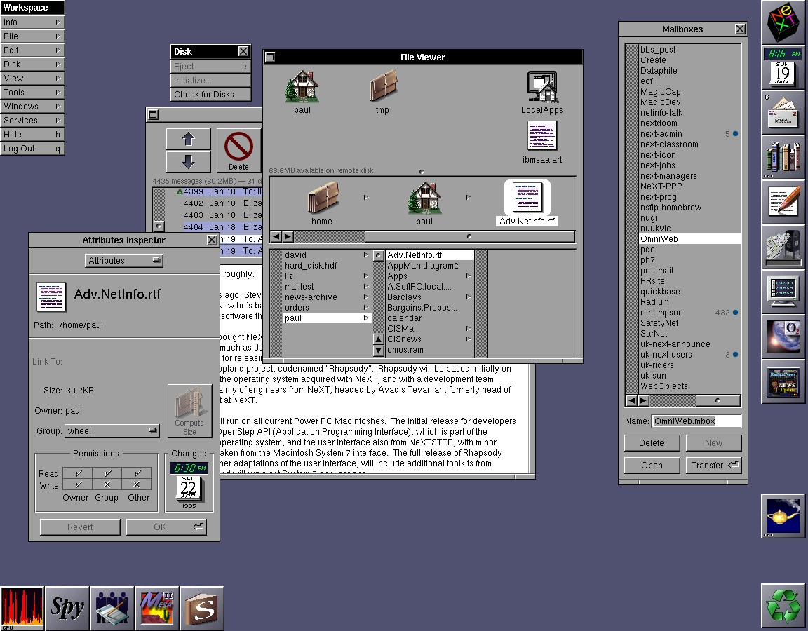

***

# OnESTEP

OneSTEP (stylized as OnESTEP to be similar to NeXTSTEP) is an open source environment for a NeXTSTEP/OpenSTEP like system. There are currently many projects that offer a similar environment, but not the base system. I also feel like some improvements could be made.

## Recommended

I recommend the following environments whle OnESTEP is under construction:

[`GNUSTEP`](http://gnustep.org/) | [GitHub organization](https://github.com/gnustep/) - Made by [GNU](https://www.gnu.org/) and its community

[`NeXTSPACE`](https://trunkmaster.github.io/) | [GitHub repository](https://github.com/trunkmaster/nextspace) - Made by Ukrainian developer [Trunkmaster](https://github.com/Trunkmaster) and the GitHub community

- Currently only works on Red Hat Enterprise Linux (RHEL) based distributions, such as Fedora, Red Hat Enterpise Linux, and CentOS. Does not currently work on other Linux distributions.

- Someone made an ISO installer for this project. It can be found [here (arm77/nextspace-iso-installer)](https://github.com/armm77/nextspace-iso-installer/)

Both of these projects come really close to the full NeXTSTEP experience, I can't decide which one is better at it, as they both do a really good job.

## Languages

OnESTEP is written in C, PostScript, Objective-C, and Objective-C++

## Base

OnESTEP is designed to look like NeXTSTEP/OpenSTEP. It currently isn't based on anything.

## Name

Microsoft commonly uses the word `one` in front of things to brand them (examples: OneDrive, OneNote, etc.) this project is meant to represent Apple, and I didn't feel like calling it `iStep`

## Character set

OnESTEP uses the NeXT character set. Here is a reference table of all characters:

## Home repositories

[Guesthouse repository](https://github.com/seanpm2001/WacOS_OnESTEP/)

This is a guesthouse repository, and not a home repository, as development mainly stays on the main WacOS side. This is just the guesthouse that the project retreats to at times. If you are already in this repository, the link is likely recursive, and will reload the page.

[Home repository](https://github.com/seanpm2001/WacOS/tree/WacOS-dev/OnESTEP/)

This is the home repository. If you are already in this repository, the link is likely recursive, and will reload the page.

***

## File info

**File type:** `Markdown document (*.md *.mkd *.mdown *.markdown)`

**File version:** `2 (2022, Sunday, May 15th at 4:50 pm PST)`

**Line count (including blank lines and compiler line):** `65`

**Current article language:** `English (US)`

***
