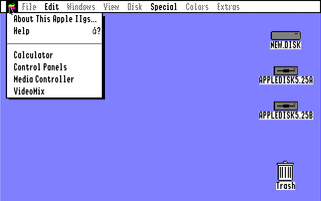

***

# OpenGS/OS

_Not to be confused with [OpenGL](/OpenGL/)_

OpenGS/OS is an open source recreation and remaster of Apples GS/OS for the Apple IIGS. This subsystem is still in planning.

## Home repositories

[Guesthouse repository](https://github.com/seanpm2001/WacOS_OpenGS/)

This is a guesthouse repository, and not a home repository, as development mainly stays on the main WacOS side. This is just the guesthouse that the project retreats to at times. If you are already in this repository, the link is likely recursive, and will reload the page.

[Home repository](https://github.com/seanpm2001/WacOS/tree/WacOS-dev/OpenGS/)

This is the home repository. If you are already in this repository, the link is likely recursive, and will reload the page.

***

## File info

**File type:** `Markdown document (*.md *.mkd *.mdown *.markdown)`

**File version:** `2 (2022, Sunday, May 15th at 5:06 pm PST)`

**Line count (including blank lines and compiler line):** `35`

**Current article language:** `English (US)`

***
