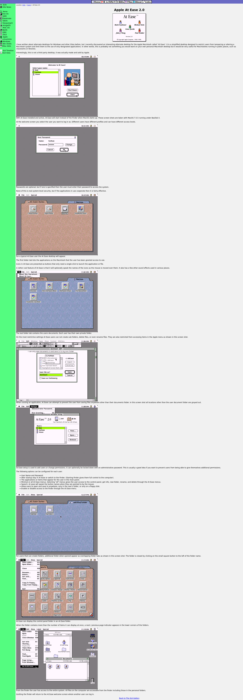

***

# WacOS

## In Ease (legacy environment)

### About the In Ease legacy environment

<b lang="en">Click/tap here to expand/collapse the long image of At Ease</b>

The In Ease environment is an open source recreation and replacement for the legacy MacOS desktop environment knownn as `At Ease` it only runs on classic/legacy WacOS.

## Language

The In Ease is currently written in C, but may be written in an additional language inthe future if needed.

## WacOS versions

By default, In Ease only works on the following subsystem variants of WacOS:

- `BaSYS 5`
- `BaSYS 6`
- `WacOS 7`
- `WacOS 8`
- `WacOS 9`

## Home repositories

[Guesthouse repository](https://github.com/seanpm2001/WacOS_In_Ease/)

This is a guesthouse repository, and not a home repository, as development mainly stays on the main WacOS side. This is just the guesthouse that the project retreats to at times. If you are already in this repository, the link is likely recursive, and will reload the page.

[Home repository](https://github.com/seanpm2001/WacOS/tree/WacOS-dev/Programs/Legacy/In_Ease/)

This is the home repository. If you are already in this repository, the link is likely recursive, and will reload the page.

***

## File info

**File type:** `Markdown document (*.md *.mkd *.mdown *.markdown)`

**File version:** `1 (2022, Sunday, May 22nd at 5:09 pm PST)`

**Line count (including blank lines and compiler line):** `55`

**Current article language:** `English (US)`

***
